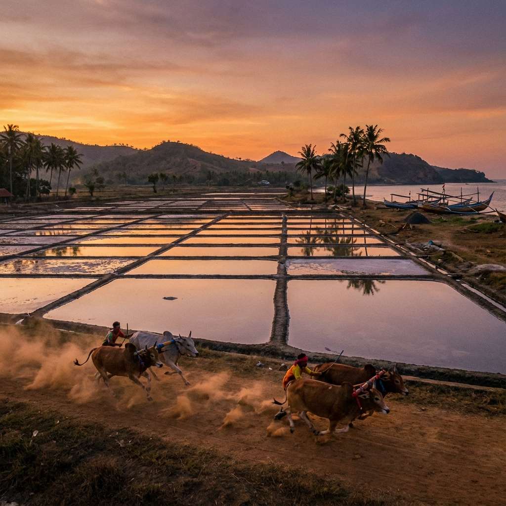

# 🏝️ Warisan Nusantara: Madura Language Translator

> **Eksplorasi Budaya Madura melalui Teknologi Neural Machine Translation**



## 📖 About The Project

**Warisan Nusantara** is a web-based application designed to preserve and promote the Madurese language and culture. At its core, it features a **Neural Machine Translation (NMT)** model capable of translating between **Indonesian** and **Madura** language (both directions).

Beyond translation, the application serves as a digital cultural showcase, featuring:
- **Interactive 3D Visuals**: A modern, particle-based 3D scene representing Madura's geography and cultural artifacts.
- **Cultural Insights**: Information about Madura's history, traditions (Karapan Sapi, Batik), and language structure.
- **Speech Integration**: Speech-to-Text (STT) capabilities to make the tool more accessible.

This project was developed as a Final Project for the **Natural Language Processing (NLP)** course (Week 14).

## ✨ Key Features

*   **🔄 Bidirectional Translation**: Accurate translation from Indonesian to Madura and vice versa using deep learning models.
*   **🎙️ Speech-to-Text**: Input text via voice recording for easier interaction.
*   **🎨 Immersive UI/UX**:
    *   **Modern Aesthetics**: Vibrant Gold & Coral color palette inspired by Madurese vibrancy.
    *   **3D Experience**: Built with `Three.js`, featuring interactive particle systems and geometric animations.
    *   **Responsive Design**: Fully functional on desktop and mobile devices.
*   **📚 Educational Content**: Dedicated sections explaining the importance of preserving local languages.

## 🛠️ Technology Stack

### Backend
*   **Python**: Core programming language.
*   **Flask**: Lightweight web framework for serving the application and API.
*   **PyTorch / TensorFlow**: (Specify which one you used for the NLP model) for the NMT model inference.
*   **FFmpeg**: For audio processing in Speech-to-Text features.

### Frontend
*   **HTML5 & CSS3**: Custom styling with a focus on modern, glassmorphism effects.
*   **JavaScript (ES6+)**: Dynamic interactions and API handling.
*   **Three.js**: For rendering the 3D cultural scenes and particle animations.
*   **FontAwesome**: For UI icons.

## 🚀 Getting Started

Follow these steps to run the project locally.

### Prerequisites
*   Python 3.8+
*   pip (Python package manager)

### Installation

1.  **Clone the repository**
    ```bash
    git clone https://github.com/yourusername/warisan-nusantara.git
    cd warisan-nusantara
    ```

2.  **Create a Virtual Environment (Optional but recommended)**
    ```bash
    python -m venv venv
    # Windows
    venv\Scripts\activate
    # macOS/Linux
    source venv/bin/activate
    ```

3.  **Install Dependencies**
    ```bash
    pip install -r requirements.txt
    ```

4.  **Run the Application**
    ```bash
    python app.py
    ```

5.  **Access the Web App**
    Open your browser and navigate to: `http://127.0.0.1:5000`

## 📂 Project Structure

```
NLP-Final-Project/
├── app.py              # Main Flask application
├── utils.py            # Helper functions (translation logic, audio processing)
├── requirements.txt    # Python dependencies
├── static/             # Static assets
│   ├── css/            # Stylesheets (style.css, opening.css)
│   ├── js/             # JavaScript files (3d_scene.js, animations.js, etc.)
│   └── images/         # Image assets
└── templates/          # HTML templates
    ├── base.html       # Base layout
    └── index.html      # Main landing page
```

## 👥 Authors

*   **[Your Name]** - *Initial Work & NLP Model Development*

## 📄 License

This project is licensed under the MIT License - see the [LICENSE](LICENSE) file for details.

---
*Created with ❤️ for Indonesian Culture*
